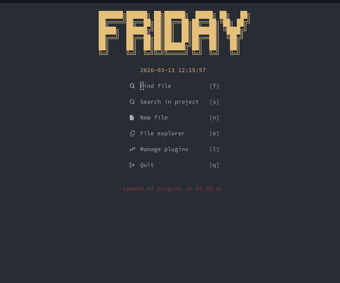

# Neovim Professional Setup

This configuration turns Neovim into a **professional polyglot editor** for software engineers: full LSP support, automatic formatting, integrated testing, and a consistent daily workflow.

### Key features

- **Modern plugin management**: `lazy.nvim` as the plugin manager.
- **Languages & LSPs**: TypeScript, PHP, Python, Go, Rust, Lua, TailwindCSS, etc.
- **Auto-completion**: `nvim-cmp` with AI-friendly support (Copilot/Tabnine ready).
- **Automatic formatting**: `conform.nvim` for consistent style.
- **Fast Navigation**: `flash.nvim` for jumping and `oil.nvim` for file editing.
- **Integrated testing**: `neotest` for running tests directly.

---

## Installation

### 1. Clone the configuration
```bash
git clone https://github.com/saul-paulus/neovim-with-lazy-vim.git ~/.config/nvim
```

### 2. Start Neovim
Open Neovim and wait for `lazy.nvim` to install all plugins. Restart after completion.

---

## ⌨️ Keymaps Documentation

Here is a summary of the keyboard commands for your daily workflow.

### 🛠️ General & Editor
| Key | Vim Command | Description |
| :--- | :--- | :--- |
| **`<leader>`** | `<Space>` | **Main Leader Key** |
| `Ctrl + s` | `:w` | Save file |
| `Ctrl + z` | `u` | Undo |
| `Ctrl + y` | `Ctrl + r` | Redo |
| `Ctrl + a` | `ggVG` | Select All Text |
| `Ctrl + f` | `/` | Search Text |
| `Ctrl + /` | `gcc` | Toggle Comment (Line) |
| `Alt + j` | - | Move line Down |
| `Alt + k` | - | Move line Up |
| `<leader>h` | `:nohlsearch` | Clear search highlights |
| `<leader>q` | `:confirm q` | Quit Neovim |

### 🪟 Windows & Buffers
| Key | Command | Description |
| :--- | :--- | :--- |
| `<leader>v` | `:vsplit` | Split window Vertically |
| `Ctrl + h` | - | Focus Left window |
| `Ctrl + j` | - | Focus Bottom window |
| `Ctrl + k` | - | Focus Top window |
| `Ctrl + l` | - | Focus Right window |
| `<Tab>` | `:bnext` | Go to Next Buffer |
| `Shift + <Tab>` | `:bprevious` | Go to Previous Buffer |
| `<leader>c` | `:bd` | Close current Buffer/Tab |

### 🧠 LSP & Code Intelligence
| Key | Action | Description |
| :--- | :--- | :--- |
| `gd` | Definition | Jump to function/variable definition |
| `gD` | Declaration | Jump to function/variable declaration |
| `gI` | Implementation | Jump to class/interface implementation |
| `gr` | References | Search for all code references |
| `K` | Hover | Show function documentation |
| `gl` | Diagnostic | View error at current line |
| `<leader>lr` | Rename | Rename variable globally |
| `<leader>la` | Code Action | Code suggestions (Quick fix) |
| `<leader>lf` | Format | Beautify code (Manual) |
| `<leader>lj` | Next Diagnostic | Jump to next error |
| `<leader>lk` | Prev Diagnostic | Jump to previous error |

### 🔍 Searching & Navigation
| Key | Plugin | Action |
| :--- | :--- | :--- |
| `<leader>ff` | **Telescope** | Find File by name |
| `<leader>fg` | **Telescope** | Search Text in entire project |
| `<leader>fb` | **Telescope** | Search Open Buffers |
| `-` | **Oil.nvim** | Open file system editor (Edit folder) |
| `\` | **Neo-tree** | Toggle sidebar file explorer |
| `s` | **Flash.nvim** | Fast jump to any text |
| `<leader>xx` | **Trouble** | Open error/diagnostic list |
| `<leader>cs` | **Trouble** | Open symbols structure (outline) |

### 🧪 Testing (Neotest)
| Key | Action | Description |
| :--- | :--- | :--- |
| `<leader>tn` | Test Nearest | Run nearest test |
| `<leader>tf` | Test File | Run all tests in this file |
| `<leader>ts` | Test Suite | Run entire test suite |
| `<leader>to` | Toggle Summary | Open test summary panel |

### 🖥️ Tabs & Terminal
| Key | Action | Description |
| :--- | :--- | :--- |
| `<leader>;` | New Terminal | Open Terminal in a new Tab |
| `<leader>an` | New Tab | Create a new empty Tab |
| `<leader>ao` | Only Tab | Close all tabs except this one |

---

## PHP (Intelephense)
Install using `:Mason`, select `intelephense`. The configuration is already optimized for modern PHP development.

## 📄 License
MIT License - [LICENSE](LICENSE)
