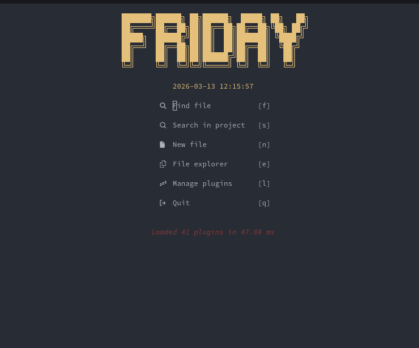

# Neovim Professional Setup

An elegant, high-performance, and **polyglot Neovim configuration** tailored for software engineers. Optimized for **Neovim 0.11+** with native LSP APIs, full Treesitter integration, automatic formatting, and integrated testing.

---

## ✨ Key Features

- ⚡ **Neovim 0.11+ Ready**: Native `vim.lsp.config` & `vim.lsp.enable` integration, zero deprecation warnings.
- 📦 **Plugin Management**: Powered by [`lazy.nvim`](https://github.com/folke/lazy.nvim).
- 🧠 **LSP & Intelligence**: TypeScript/JS, PHP (Intelephense), Python, Go, Rust, Lua, Vue, Prisma, TailwindCSS, HTML/CSS, JSON/YAML.
- 🌳 **Treesitter Syntax & Highlighting**: Pinned `master` branch with custom query overrides.
- 💅 **Code Formatting**: Fast, non-blocking auto-formatting via [`conform.nvim`](https://github.com/stevearc/conform.nvim).
- 🚀 **Navigation & Search**: Fast jump via [`flash.nvim`](https://github.com/folke/flash.nvim), floating filesystem editor with [`oil.nvim`](https://github.com/stevearc/oil.nvim), and sidebar explorer with [`neo-tree.nvim`](https://github.com/nvim-neo-tree/neo-tree.nvim).
- 🔭 **Fuzzy Finder**: Rich search across files, text, buffers, and git via [`telescope.nvim`](https://github.com/nvim-telescope/telescope.nvim).
- 🧪 **Testing Framework**: Integrated test runner with [`neotest`](https://github.com/nvim-neotest/neotest) (Jest, Python, Go, Rust).
- 📊 **UI & Statusline**: Glassmorphism dashboard, [`lualine.nvim`](https://github.com/nvim-lualine/lualine.nvim), floating diagnostics with [`noice.nvim`](https://github.com/folke/noice.nvim), and breadcrumbs with [`barbecue`](https://github.com/utilyre/barbecue.nvim).

---

## 📋 Requirements

- **Neovim** `v0.11.0` or later
- **Git** `2.19+`
- **rg** ([ripgrep](https://github.com/BurntSushi/ripgrep))
- **fd** ([fd-find](https://github.com/sharkdp/fd))
- **Node.js** & **npm** (for LSPs like Pyright, TypeScript, Volar, etc.)
- A **Nerd Font** (e.g. `SauceCodePro Nerd Font` or `FiraCode Nerd Font`)

---

## 📦 Installation & Setup

### 1. Clone the repository

```bash
git clone https://github.com/saul-paulus/neovim-with-lazy-vim.git ~/.config/nvim
```

### 2. Launch Neovim

```bash
nvim
```

`lazy.nvim` will automatically download, compile, and configure all plugins.

### 3. Sync & Update Parsers

Inside Neovim, run:
```vim
:Lazy sync
:TSUpdate
```

---

## ⌨️ Keymaps Reference

### 🛠️ General & Editor

| Key | Mode | Command / Action | Description |
| :--- | :--- | :--- | :--- |
| **`<Space>`** | Normal | - | **Main Leader Key** |
| `Ctrl + s` | Normal | `:w` | Save active file |
| `Ctrl + z` | Normal | `u` | Undo |
| `Ctrl + y` | Normal | `Ctrl + r` | Redo |
| `Ctrl + a` | Normal | `ggVG` | Select all text in buffer |
| `Ctrl + f` | Normal | `/` | Search text in buffer |
| `Ctrl + /` | Normal/Visual | `gcc` / `gc` | Toggle comment |
| `Alt + j` | Normal | `:m .+1<cr>==gi` | Move current line down |
| `Alt + k` | Normal | `:m .-2<cr>==gi` | Move current line up |
| `<leader>h` | Normal | `:nohlsearch` | Clear search highlighting |
| `<leader>q` | Normal | `:confirm q` | Quit Neovim cleanly |

### 🪟 Windows & Buffers

| Key | Mode | Action | Description |
| :--- | :--- | :--- | :--- |
| `<leader>v` | Normal | `:vsplit` | Split window vertically |
| `Ctrl + h` | Normal | `<C-w>h` | Focus left window |
| `Ctrl + j` | Normal | `<C-w>j` | Focus bottom window |
| `Ctrl + k` | Normal | `<C-w>k` | Focus top window |
| `Ctrl + l` | Normal | `<C-w>l` | Focus right window |
| `<Tab>` | Normal | `:bnext` | Next buffer |
| `Shift + <Tab>` | Normal | `:bprevious` | Previous buffer |
| `<leader>c` | Normal | `:bd` | Close current buffer |

### 🧠 LSP & Code Intelligence

| Key | Mode | Action | Description |
| :--- | :--- | :--- | :--- |
| `gd` | Normal | Definition | Jump to symbol definition |
| `gD` | Normal | Declaration | Jump to symbol declaration |
| `gI` | Normal | Implementation | Jump to implementation |
| `gr` | Normal | References | Find all references |
| `K` | Normal | Hover | Display documentation popup |
| `gl` | Normal | Open Float | Show line diagnostics |
| `<leader>lr` | Normal | Rename | Rename symbol project-wide |
| `<leader>la` | Normal | Code Action | Quick fixes and refactoring |
| `<leader>lf` | Normal | Format | Format document manually |
| `<leader>lj` | Normal | Next Diagnostic | Jump to next error/warning |
| `<leader>lk` | Normal | Prev Diagnostic | Jump to previous error/warning |
| `<leader>li` | Normal | `:LspInfo` | View LSP status |
| `<leader>lI` | Normal | `:Mason` | Open Mason package manager |

### 🔍 Search & File Navigation

| Key | Plugin | Action | Description |
| :--- | :--- | :--- | :--- |
| `<leader>ff` | **Telescope** | Find Files | Search files by name |
| `<leader>fg` | **Telescope** | Live Grep | Search text across whole project |
| `<leader>fb` | **Telescope** | Buffers | Search active buffers |
| `-` | **Oil.nvim** | Open Oil | Open file system buffer |
| `\` | **Neo-tree** | Toggle Tree | Toggle sidebar file explorer |
| `s` | **Flash.nvim** | Flash Jump | Fast 2-character jump anywhere |
| `<leader>xx` | **Trouble** | Diagnostics | Open workspace diagnostics list |
| `<leader>cs` | **Trouble** | Symbols | View document symbols outline |

### 🧪 Testing (Neotest)

| Key | Command | Description |
| :--- | :--- | :--- |
| `<leader>tn` | Test Nearest | Run the test nearest to cursor |
| `<leader>tf` | Test File | Run all tests in current file |
| `<leader>ts` | Test Suite | Run entire test suite |
| `<leader>tl` | Test Last | Re-run last test |
| `<leader>to` | Toggle Summary | Open/close test summary sidebar |

---

## 🛠️ Maintenance Commands

- **`:Lazy`**: Manage, sync, or clean plugins.
- **`:Mason`**: Install, update, or remove LSPs, formatters, and linters.
- **`:TSUpdate`**: Update all installed Tree-sitter parsers.
- **`:checkhealth`**: Verify system health and plugin dependencies.

---

## 📄 License

This configuration is open-source software licensed under the [MIT License](LICENSE).
